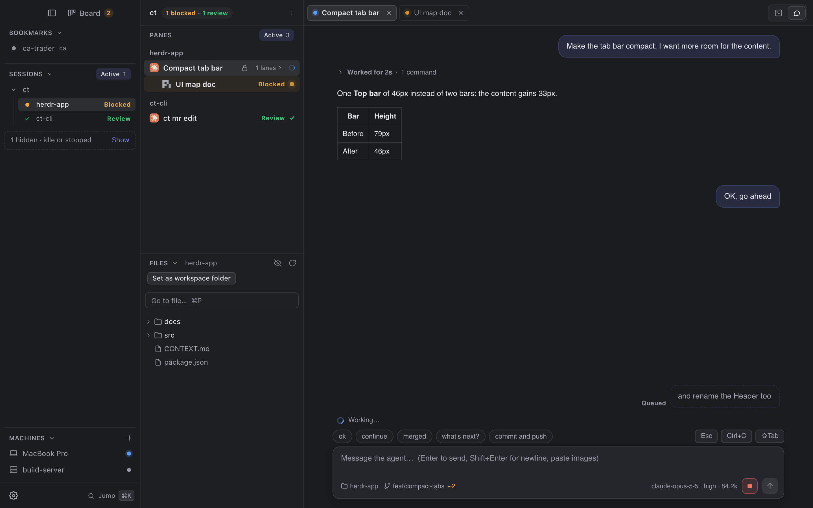
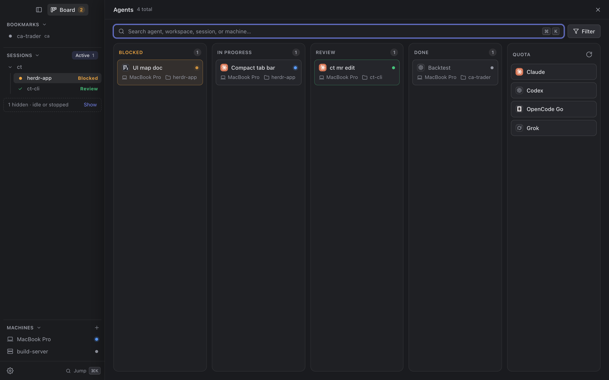
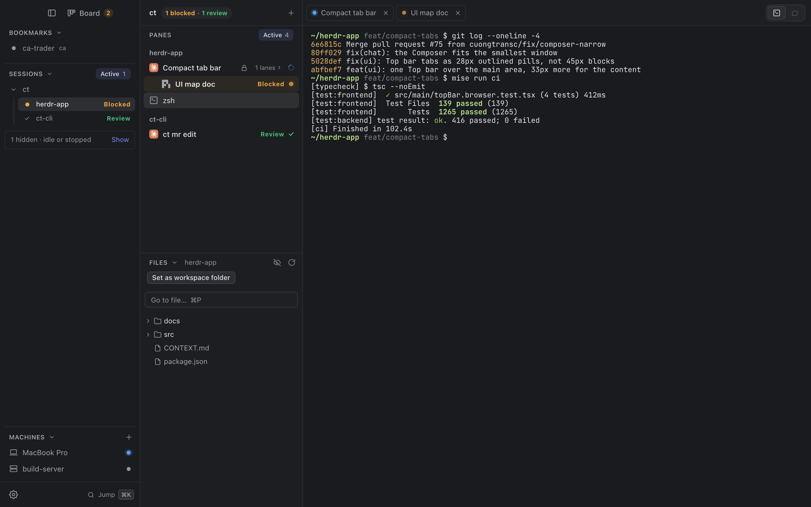

# Herdr

A macOS desktop client for the [herdr](https://herdr.dev) terminal multiplexer. It shows the local machine and any number of SSH machines in one sidebar (machines, sessions, workspaces, tabs, panes with agent status), and opens a pane as a real terminal or as a Chat lens for coding agents, and browses the selected workspace's files in a Files panel under the agent list, opening them as tabs next to the open agents. Built with Tauri v2, React 19 and zustand 5.



| Agent Board | Terminal lens |
|---|---|
|  |  |

How to use the Files panel, protected panes, Fork session and `/btw`: [docs/guide](docs/guide/00-index.md).

## Install

1. Install [herdr](https://herdr.dev) (see Requirements below).
2. Download `Herdr_<version>_universal.dmg` from the [latest release](https://github.com/cuongnbms/herdr-app/releases/latest). It runs on both Apple Silicon and Intel Macs.
3. Open the `.dmg` and drag Herdr into Applications.
4. The app is not notarized by Apple, so macOS blocks the first launch. Clear the quarantine flag once:

   ```sh
   xattr -dr com.apple.quarantine /Applications/Herdr.app
   ```

   Or try to open Herdr, then go to System Settings → Privacy & Security and click **Open Anyway**.

To update, download the new `.dmg`, replace the app in Applications and run the `xattr` command again.

## Requirements

- macOS.
- [herdr](https://herdr.dev) 0.9.x or newer, speaking protocol 22 (any other protocol is reported as `incompatible`).
- OpenSSH (`ssh` on the PATH) for remote machines.
- Remote machines run Linux or macOS with a POSIX-compatible login shell (bash, zsh or sh), and their `sshd` must allow Unix socket forwarding: `AllowStreamLocalForwarding yes` in `sshd_config`.

Passphrase and host-key prompts are handled by the interactive Connect dialog, so keys that need a passphrase and first-time hosts work without preparing the SSH agent.

## Development

```sh
pnpm install
pnpm tauri dev      # run the app with hot reload
pnpm test           # frontend tests (vitest)
pnpm typecheck
cd src-tauri
cargo test          # backend tests
cargo clippy -- -D warnings
cargo test -- --ignored --test-threads=1   # integration tests against a real local herdr
pnpm tauri build    # produces src-tauri/target/release/bundle/macos/Herdr.app
```

### Releasing

Bump `version` in `package.json`, `src-tauri/Cargo.toml` and `src-tauri/tauri.conf.json`, commit, then push a matching tag:

```sh
git tag v0.1.0 && git push origin v0.1.0
```

`.github/workflows/release.yml` builds a universal, ad-hoc signed `.dmg` and attaches it to a draft GitHub Release. Review the draft and publish it.

The ignored integration tests start isolated sessions named `herdrapp-test-*` on the local herdr and always stop and delete them. The SSH test only runs when `HERDR_APP_SSH_TEST` is set.

## Known limits

- Remote shells must be POSIX-compatible (no fish or nushell as login shell).
- The Chat lens supports Claude Code and pi only; other agents open in the Terminal lens.
- A terminal that is attached elsewhere is held: use Take over to attach it here.

See `CONTEXT.md` for the domain vocabulary, `docs/` for the design spec and ADRs, and `THIRD_PARTY_NOTICES.md` for upstream credits.
